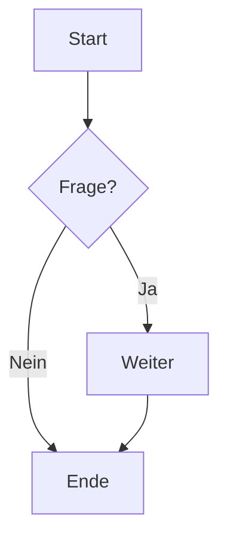

# Inhaltsverzeichnis

- [Überschriften](#überschriften)
- [Absätze & Zeilenumbrüche](#absätze--zeilenumbrüche)
- [Hervorhebungen](#hervorhebungen)
- [Zitate](#zitate)
- [Listen](#listen)
- [Aufgabenlisten](#aufgabenlisten)
- [Links](#links)
- [Bilder](#bilder)
- [Code (Inline & Block)](#code-inline--block)
- [Tabellen](#tabellen)
- [Horizontale Linie](#horizontale-linie)
- [Fußnoten](#fußnoten)
- [Referenz‑Links](#referenz-links)
- [Definition Lists (Pseudo)](#definition-lists-pseudo)
- [Details/Accordion](#detailsaccordion)
- [Admonitions (GitHub‑Hinweise)](#admonitions-github-hinweise)
- [Emojis](#emojis)
- [Task‑Blockzitate (verschachtelt)](#task-blockzitate-verschachtelt)
- [HTML in Markdown](#html-in-markdown)
- [Mermaid‑Diagramm](#mermaid-diagramm)
- [Mathe (KaTeX/LaTeX‑Stil)](#mathe-katexlatex-stil)
- [Anker/IDs](#ankerids)
- [Escape‑Zeichen](#escape-zeichen)
- [Front Matter](#front-matter)
- [Tipps zur Kompatibilität](#tipps-zur-kompatibilität)

---

## Überschriften

# H1
## H2
### H3
#### H4
##### H5
###### H6

Alternativ (Setext):
H1 mit Gleichzeichen
====================

H2 mit Bindestrichen
--------------------

## Absätze & Zeilenumbrüche

Ein Absatz endet nach einer **leerzeile**.

Erzwungener Zeilenumbruch mit zwei Leerzeichen am Zeilenende.  
Diese Zeile bricht um.

## Hervorhebungen

*kursiv* oder _kursiv_  
**fett** oder __fett__  
***fett & kursiv***  
~~durchgestrichen~~  
==markiert== (unterstützt nicht überall)  
`inline code`

## Zitate

> Ein einfaches Zitat.
>
> > Verschachteltes Zitat.
>
> Mit **Formatierung** und `Code`.

## Listen

Ungeordnet:
- Punkt A
- Punkt B
  - Unterpunkt B1
  - Unterpunkt B2
- Punkt C

Oder:
* Stern A
* Stern B

Geordnet:
1. Schritt eins
2. Schritt zwei
   1. Unter‑Schritt
   2. Unter‑Schritt
3. Schritt drei

Gemischt:
1. Item
   - Subitem
   - Subitem

## Aufgabenlisten

- [ ] Offen
- [x] Erledigt
- [ ] Teilaufgabe
  - [x] Unteraufgabe erledigt
  - [ ] Unteraufgabe offen

## Links

Inline‑Link: [OpenAI](https://www.openai.com)  
Titel‑Attribut: [Suche](https://duckduckgo.com "Datenschutzfreundliche Suche")  
Auto‑Link: <https://example.org>  
E-Mail: <mailto:ich@example.org>

Siehe auch [Referenz‑Links](#referenz-links).

## Bilder

Inline‑Bild mit Alt‑Text:  


Bild als Link:  
[](https://example.org)

Relative Pfade funktionieren je nach Repo‑Struktur: ``

## Code (Inline & Block)

Inline: `const x = 42;`

Fenced Codeblocks (mit Syntax‑Highlighting):

```bash
# Bash‑Beispiel
echo "Hallo Welt"
```

```python
def fib(n: int) -> int:
    a, b = 0, 1
    for _ in range(n):
        a, b = b, a + b
    return a

print(fib(10))
```

```json
{
  "name": "Beispiel",
  "version": "1.0.0",
  "private": true
}
```

```html
<!doctype html>
<html lang="de">
  <head><meta charset="utf-8"><title>Demo</title></head>
  <body><h1>Hallo</h1></body>
</html>
```

Einrückung (4 Leerzeichen) erzeugt ebenfalls Codeblöcke (nicht überall empfohlen).

## Tabellen

Einfache Tabelle:

| Sprache | Typisiert | Paradigma        |
|---------|-----------|------------------|
| Python  | Dynamisch | Mehrparadigmatisch |
| Go      | Statisch  | Kompiliert       |
| Rust    | Statisch  | Systemnah        |

Ausrichtung:

| Links | Mitte | Rechts |
|:------|:-----:|------:|
| a     |   b   |     c |
| d     |   e   |     f |

Zellen können **Formatierungen**, `Code` und Links enthalten.

## Horizontale Linie

---

Oder `***` oder `___` auf eigener Zeile.

## Fußnoten

Eine Aussage mit Fußnote.[^1] Und noch eine weitere.[^2]

[^1]: Das ist die erste Fußnote mit *Formatierung*.
[^2]: Zweite Fußnote, kann auch Links enthalten: <https://example.org>.

## Referenz‑Links

Ein Link [mit Referenz][ref1] und noch einer [zweiter Link][ref2].  
Auch Bilder können referenziert werden: ![Platzhalter][img1]

[ref1]: https://www.wikipedia.org "Wikipedia"
[ref2]: https://developer.mozilla.org "MDN Web Docs"
[img1]: https://via.placeholder.com/300x120 "Platzhalter"

## Definition Lists (Pseudo)

**Begriff**  
: Erklärungstext zum Begriff (Pseudo‑Notation, GitHub rendert HTML‑DL besser)

<dl>
  <dt>API</dt>
  <dd>Application Programming Interface</dd>
  <dt>CLI</dt>
  <dd>Command Line Interface</dd>
</dl>

## Details/Accordion

<details>
  <summary>Klicke für mehr Details</summary>

  Dieser Text ist verborgen und klappt auf.

  - Unterstützt in GitHub, vielen Renderern
  - Kann **Markdown** enthalten

</details>

## Admonitions (GitHub‑Hinweise)

> [!NOTE]
> Dies ist ein Hinweisblock.

> [!TIP]
> Nützlicher Tipp mit kurzer Erklärung.

> [!IMPORTANT]
> Wichtige Information, die hervorsticht.

> [!WARNING]
> Warnung vor möglichen Problemen.

> [!CAUTION]
> Vorsicht, hier lieber zweimal hinschauen.

## Emojis

Standard‑Emojis: 😊 🚀 🔥  
GitHub Shortcodes: `:sparkles:` :sparkles: `:tada:` :tada:

## Task‑Blockzitate (verschachtelt)

> - [x] Dokument prüfen
> - [ ] Reviewer zuweisen
>   > - [ ] Zweite Meinung einholen

## HTML in Markdown

<div style="border:1px solid #ccc; padding:8px">
  <strong>HTML</strong> kann in vielen Renderern gemischt werden.
</div>

Achtung: Nicht jeder Renderer erlaubt beliebiges HTML (Sicherheitsgründe).

## Mermaid‑Diagramm

> Hinweis: Funktioniert in GitHub, GitLab, MkDocs (mit Plugin) u. a.



## Mathe (KaTeX/LaTeX‑Stil)

> Rendering benötigt Unterstützung (z. B. GitHub Issues/PRs, viele Docs‑Engines).

Inline: $E = mc^2$, $\alpha + \beta \ge \gamma$

Block:

$$
\int_{0}^{\infty} e^{-x^2}\,dx = \frac{\sqrt{\pi}}{2}
$$

## Anker/IDs

Jede Überschrift erhält automatisch einen Anker (GitHub‑Stil).  
Beispiel: `# Anker/IDs` → Link mit `#ankerids` (ohne Sonderzeichen, Kleinschreibung).

## Escape‑Zeichen

Reservierte Zeichen mit Backslash escapen: \* \_ \` \{ \} \[ \] \( \) \# \+ \- \. \! \| \< \> \\

## Front Matter

Oben in dieser Datei befindet sich YAML Front Matter. Viele Static‑Site‑Generatoren nutzen das.

## Tipps zur Kompatibilität

- **Flavor:** Es gibt CommonMark, GitHub‑Flavored Markdown (GFM) etc. Nicht alles ist überall identisch.
- **Erweiterungen:** Mermaid, Math, Admonitions sind Erweiterungen – abhängig vom Renderer.
- **HTML‑Sicherheit:** Einige Plattformen filtern HTML.
- **Zeilenumbrüche:** Manche Renderer verlangen zwei Leerzeichen für harte Umbrüche.
- **Tabellen & Aufgabenlisten:** Teil des GFM, aber nicht in *jedem* Parser.

Viel Spaß mit Markdown! 🎉
