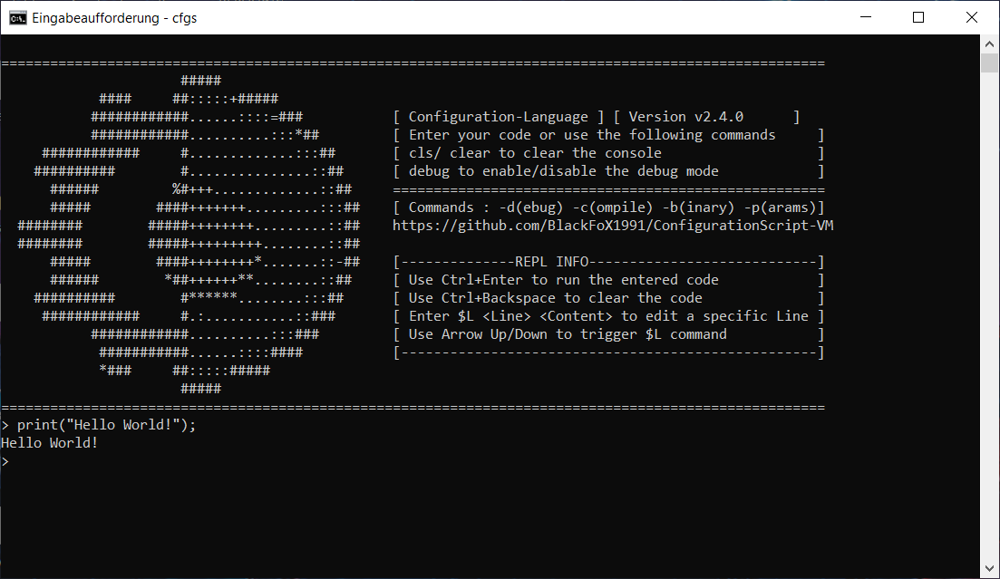
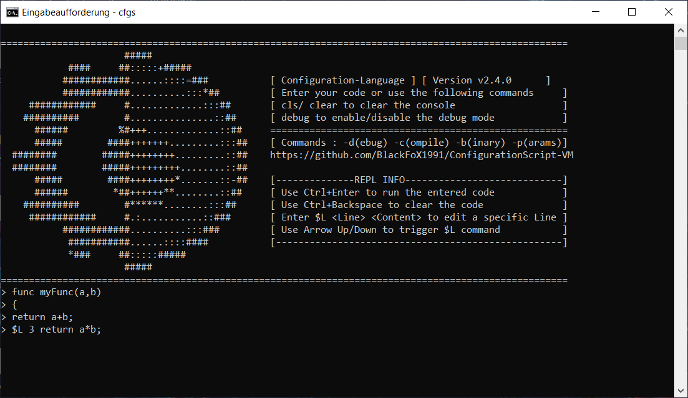
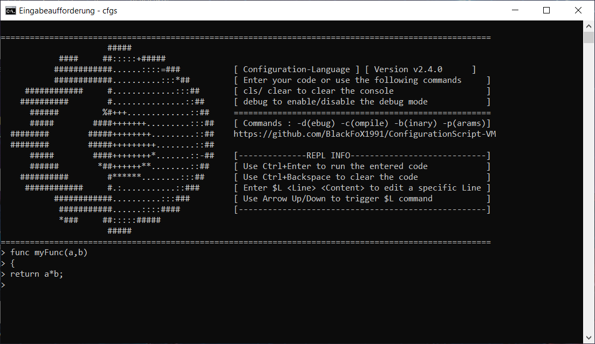
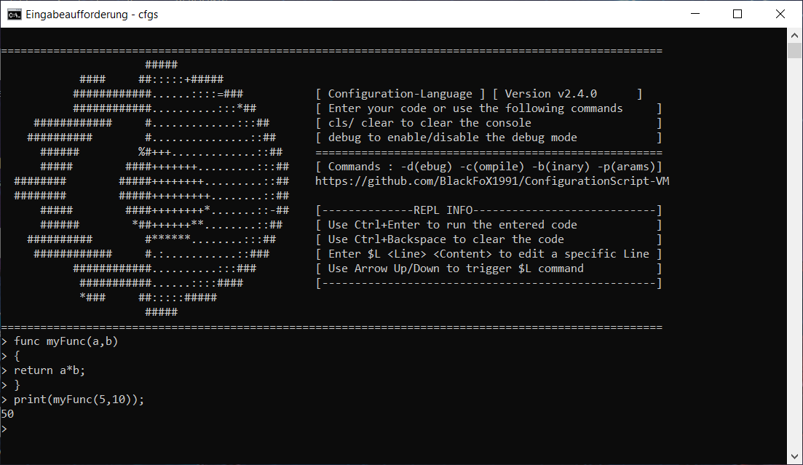
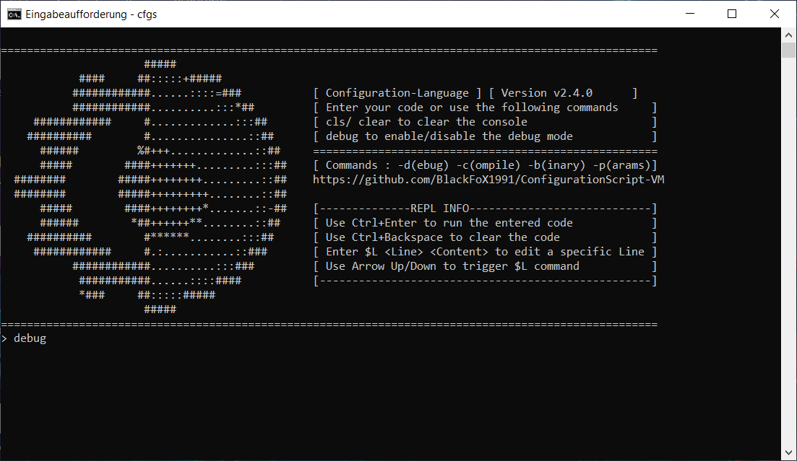
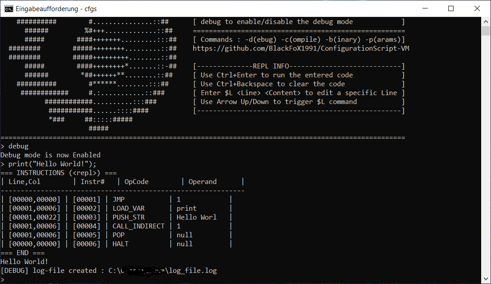
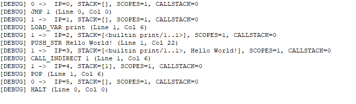
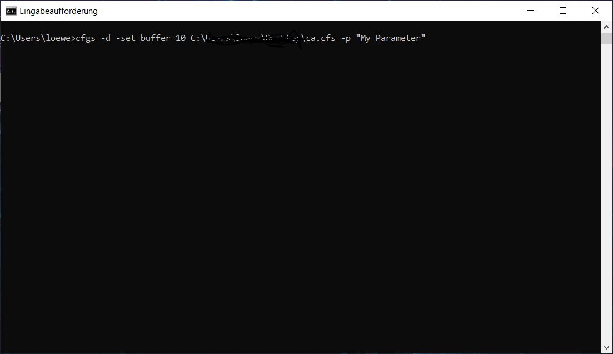
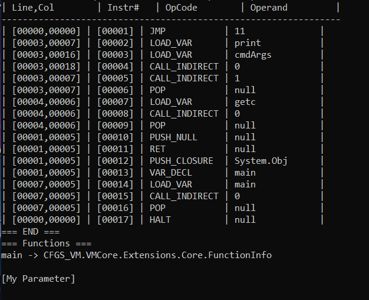
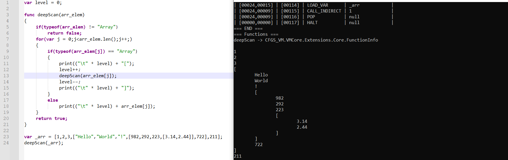

# Introduction

Here’s an updated introduction to **Configuration-Language (CFGS)** and its REPL, reflecting the latest features and workflow.

## Origins

**Configuration-Language (CFGS)** grew out of earlier interpreters/compilers (**LemonVM**, **Codium**, **Symvl**). Those projects helped shape the design for a fresh, pragmatic scripting language that’s embeddable in .NET projects. Development continues actively.

## What is Configuration-Language?

CFGS is a lightweight, dynamic, C-like scripting language—similar in spirit to Lua or Python—intended for quick, flexible scripting. It’s implemented on **.NET** and is easy to embed in .NET applications.

## Features (overview)

- Algebraic expressions, ternary, null‑coalescing
- Arrays, dictionaries
- Variables, functions, closures
- Classes (incl. inheritance / primary ctors)
- Control structures (loops, conditionals)
- Enums
- File I/O (**stdlib**), HTTP (**httplib**)
- REPL with multiline input, in‑line line editing, debug mode, and command‑line integration

---

# Quick Start (REPL)

Extract the latest release and start **CFGS** to open the **REPL** (*Read–Eval–Print Loop*). The screenshots below walk through the common flow.


---

Enter your code. Use **Enter** for a new line and **Ctrl+Enter** to submit the entire block.



---

Multiline input is indicated by the continued prompt. You can edit previous lines inline (see `$L` below).


### Editing a specific line with `$L`
Use:
```
$L <lineNumber> <content>
```
`lineNumber` is **1‑based**. If you specify `bufferLength + 1`, the line is **appended**. After a successful edit, the REPL **redraws** the buffer.








---

# Debug Mode

Enable **debug mode** by typing `debug` as the **first line** and pressing Enter. This toggles detailed tracing.



A trace view illustrates the executed VM instructions. This is useful for understanding control flow and diagnosing issues.



### Log file

Debug mode also writes a log file with detailed steps. A size cap prevents the log from growing unbounded.



---

# Command‑line Usage

You can run scripts or start specialized modes via the command line.



### `cmdArgs` parsing (updated)
To pass arguments into `cmdArgs`, you must now specify **`-p`** or **`-params`**. **All subsequent arguments** are consumed by `cmdArgs`.



Example:
```
cfgs.exe myscript.cfs -p foo bar baz
# In cmdArgs, you will receive: ["foo","bar","baz"]
```

Other useful flags:
- `-d` / `--debug` — toggle debug mode for this run
- `-c` — compile `.cfs` to a packed VM bytecode file (`.cfb`)

Notes:
- The legacy `-b` flag is obsolete; CFGS auto‑detects `.cfb` now.
- When compiling `.cfs`, imports are bundled into one `.cfb`.
- Compiled `.cfb` requires CFGS and any used libraries.

---

# REPL Commands & Shortcuts

**Commands** (enter as *first line* and press Enter):
- `exit` / `quit` — leave the REPL
- `clear` / `cls` — clear screen and reprint the header
- `debug` — toggle debug mode

**Keyboard shortcuts**:
- **Enter** — new line
- **Ctrl+Enter** — submit the current multiline block
- **Ctrl+Backspace** — clear screen (same as `clear`/`cls`)
- **↑ / ↓** — pre‑fill input with `$L <N> ` to target a line for editing (↑ decreases N, ↓ increases N)

**Line editing with `$L`**:
- `$L <N> <content>` — replace line **N** (1‑based)
- `$L <N>` where `N = buffer length + 1` — append a new last line
The REPL redraws the buffer after a `$L` edit.


## Writing and running code from cfs file

You don’t have to use the REPL—CFGS scripts can be written as **`.cfs`** files and executed from the command line.



### Workflow

1. **Create a file** `myscript.cfs` in any editor ( for example Notepad++ )
2. **Write CFGS code**
3. **Run it** with CFGS:

   ```bash
   cfgs.exe path\to\myscript.cfs
   ```
4. (Optional) **Debug mode**:

   ```bash
   cfgs.exe path\to\myscript.cfs -d
   ```
5. (Optional) **Compile to bytecode** (`.cfb`):

   ```bash
   cfgs.exe path\to\myscript.cfs -c
   ```

   The compiled file runs with CFGS and any required plugins you've used.

### Tips

Here’s a cleaner version:

* You can pass **multiple files** as arguments.
* **Flags apply to every file** in the argument list.
* To pass parameters to `cmdArgs`, include **`-p`** or **`-params`**; **everything that follows** is forwarded to `cmdArgs`. So make sure you've set this Flag in the right order!


---

# Have fun!

If you need more help, see the language docs in the repository README or open an issue/discussion.
