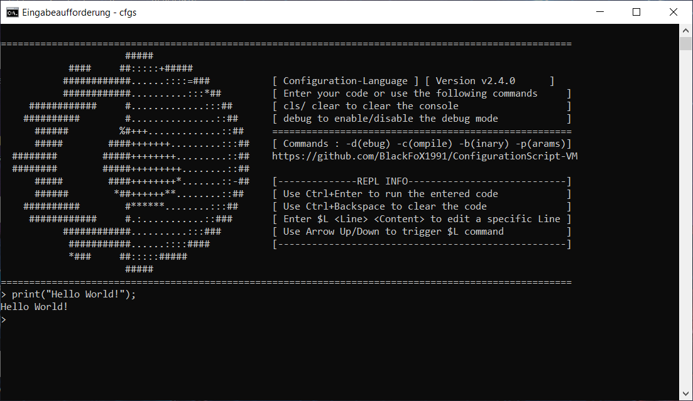
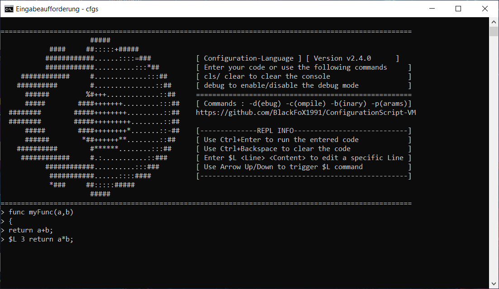
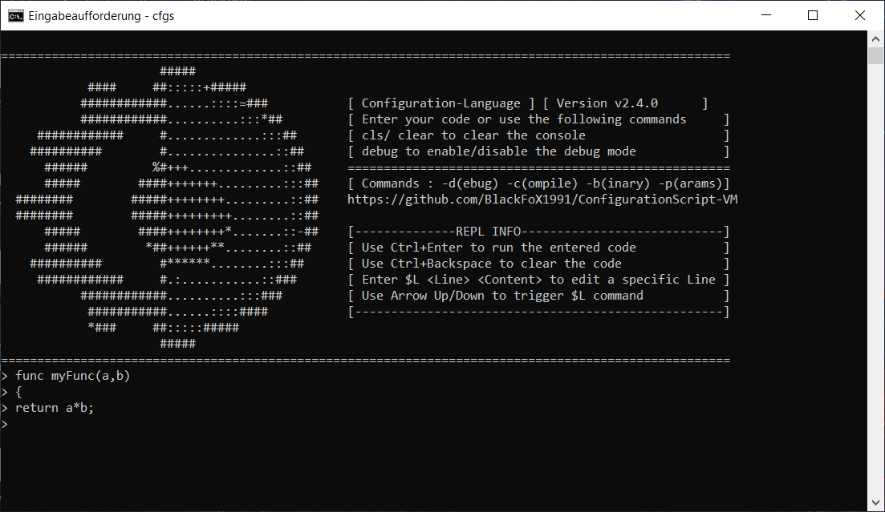
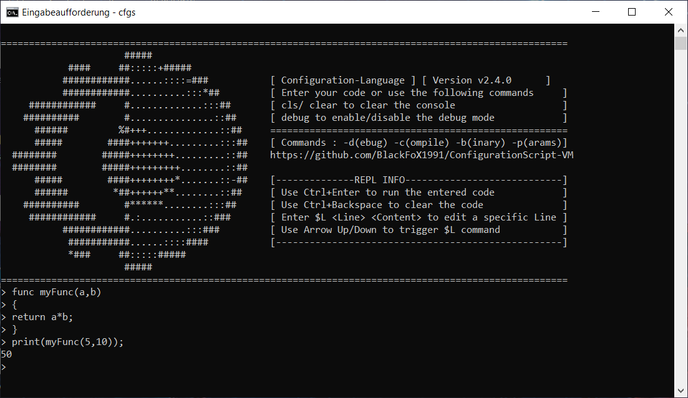
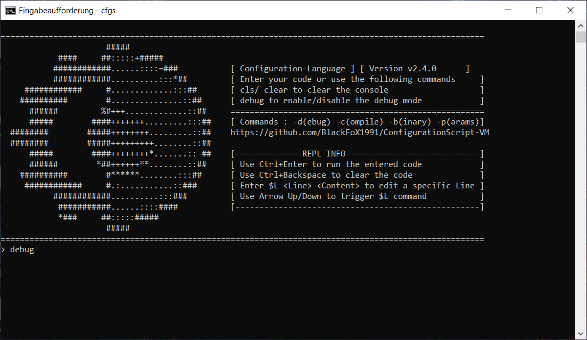
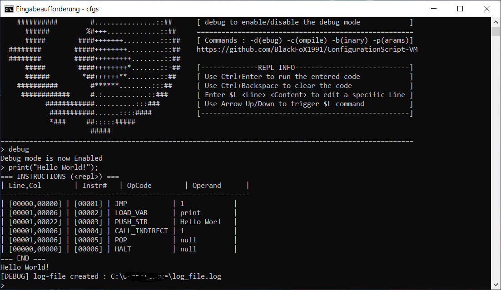
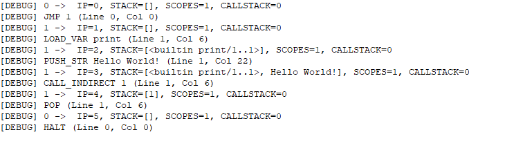
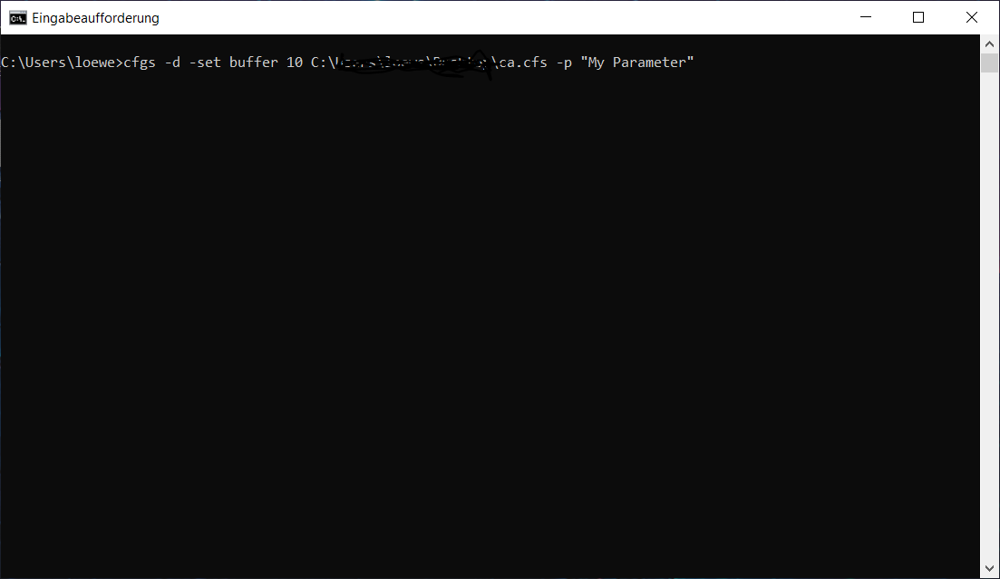
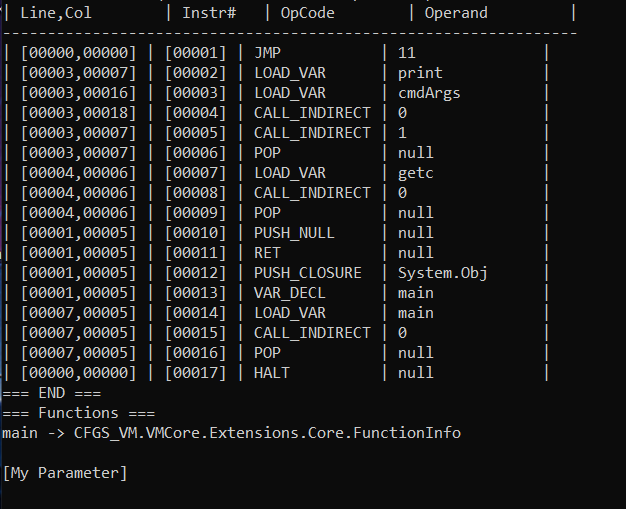

# Introduction

This document introduces Configuration-Language (CFGS), the REPL workflow, and the language additions currently available in this repository.

## Origins

Configuration-Language (CFGS) grew out of earlier interpreter/compiler projects (LemonVM, Codium, Symvl). The goal is a pragmatic scripting language that is easy to embed in .NET applications.

## What is CFGS?

CFGS is a lightweight, dynamic, C-like scripting language (comparable in spirit to Lua or Python) for automation, tooling, and application scripting.

## Feature overview

- Expressions, ternary operator, null coalescing (`??`)
- Arrays, dictionaries, slicing
- Byte conversion and binary file I O
- Variables, functions, closures
- Classes, inheritance, enums
- Control flow (`if`, `while`, `for`, `foreach`, `match`)
- `foreach` in three styles: value, index/key+value pair, destructuring target
- Imports (`.cfs`, `.dll`)
- REPL with multiline input and line editing
- Error diagnostics with categories, source location, and stack traces

---

# Quick Start (REPL)

Extract the latest release and start `cfgs.exe` without a script path to open the REPL.


Enter code. Use `Enter` for a new line and `Ctrl+Enter` to execute the full buffer.



Multiline mode keeps the current buffer until submission.


## Edit a specific line with `$L`

Use:

```txt
$L <lineNumber> <content>
```

- `lineNumber` is 1-based.
- `lineNumber == bufferLength + 1` appends a new line.






---

# Debug Mode

Type `debug` as the first line in REPL to toggle debug mode.



In debug mode, CFGS prints VM instructions and writes `log_file.log`.




---

# Command-line usage

Run a script:

```bash
cfgs.exe path\to\myscript.cfs
```

Enable debug output:

```bash
cfgs.exe path\to\myscript.cfs -d
# alias: -debug
```

Pass values into `cmdArgs`:

```bash
cfgs.exe myscript.cfs -p foo bar baz
# alias: -params
```

All arguments after `-p`/`-params` are forwarded to `cmdArgs`.

Set runtime settings:

```bash
cfgs.exe -s buffer 5000
cfgs.exe -s ansi 0
cfgs.exe -s ansi 1
# alias: -set
```

Notes:

- Binary mode was removed.
- `.cfb` files are rejected.
- `-c` and `-b` are no longer valid commands.




---

# New Language Features

## 1) Module system hardening

Supported import forms:

```cfs
import "path/module.cfs";
import { foo, bar as localBar } from "path/module.cfs";
import * as Lib from "path/module.cfs";
import foo from "path/module.cfs";
import "CFGS.StandardLibrary.dll";
```

Rules:

- Imports are only allowed at the script header (top of file).
- If a module has explicit exports, bare import (`import "...";`) is not allowed.
- Named/namespace imports from `.dll` are not allowed.
- `.dll` imports are fail-fast and atomic: on registration error, plugin symbols are not partially visible.
- Duplicate symbol conflicts are reported as parse errors.

Plugin directory loading (host-side `LoadPluginsFrom(...)`) now surfaces aggregated failures instead of silently skipping broken dlls.

## 2) Function calls and parameters

### Defaults and named arguments

```cfs
func sum3(a, b = 10, c = 100) { return a + b + c; }

sum3(1);              # 111
sum3(1, c: 5);        # 16
sum3(1, c: 5, b: 2);  # 8
```

### Rest and spread

```cfs
func collect(a, b = 2, *rest) {
    return a + b + len(rest);
}

var vals = [4, 6, 8];
collect(*vals);        # spread array into positional args
collect(*[1], b: 7);   # spread + named
```

Rules:

- Rest parameter must be last.
- Rest parameter cannot have a default.
- Spread argument must be an array/list.
- Positional arguments cannot follow named arguments.

## 3) Foreach improvements

`foreach` now supports multiple target styles:

```cfs
# value iteration
foreach (var v in arr) { ... }

# index/value on arrays (or key/value on dictionaries)
foreach (var i, v in arr) { ... }
foreach (var k, v in dict) { ... }

# destructuring target
foreach (var [a, b] in pairs) { ... }
foreach (var {x, y: yy} in objects) { ... }
```

Without `var`, existing variables are assigned:

```cfs
var i = 0;
var v = 0;
foreach (i, v in arr) { ... }
```

## 4) Match patterns and guards

```cfs
func classify(v) {
    return v match {
        [var a, var b] if (a == b): "same",
        {"tag": "num", "value": var n} if (n > 10): "big",
        _ if (v == null): "nil",
        _: "other"
    };
}
```

You can use array/dict patterns, variable bindings, wildcard (`_`), and guards (`if (...)`) in both statement and expression `match` forms.

## 5) Destructuring (general)

### `var` / `const` destructuring

```cfs
var [a, [b, c], _] = [10, [20, 30], 40];
const {x, y: yy, inner: {z}} = {"x": 1, "y": 2, "inner": {"z": 9}};
```

### Assignment destructuring

```cfs
var q = 0;
var r = 0;
[q, r] = [3, 4];

var dx = 0;
var dy = 0;
({x: dx, y: dy} = {"x": 1, "y": 2});
```

Note: Object assignment destructuring must be parenthesized (`({ ... } = value);`) to avoid block parsing ambiguity.

### Parameter destructuring

```cfs
func sum_pair([m, n]) { return m + n; }
func read_obj({x, y: y2}) { return x * 10 + y2; }

func with_array_default([u, v] = [1, 2]) { return u + v; }
func with_dict_default({a, b: bb} = {"a": 3, "b": 4}) { return a + bb; }
```

Dependent defaults also work with destructured params:

```cfs
func order_from_destructure([sx] = [7], sy = sx) {
    return sy;
}
```

## 6) Error system and diagnostics

Errors are normalized with category, location, and language stack trace where available.

Example output shape:

```txt
[ParseError] expected identifier
at myscript.cfs:12:8
```

Runtime errors include language stack traces:

```txt
[RuntimeError] undefined variable 'x'
at myscript.cfs:4:10
stacktrace:
at myscript.cfs:4:10
at myscript.cfs:9:2
```

Error tracking:

- Enabled by default.
- Disable with `CFGS_DISABLE_ERROR_TRACKING=1`.
- Override log path with `CFGS_ERROR_TRACKING_PATH=<path-to-jsonl>`.
- Default log file: `%LOCALAPPDATA%\Configuration Language\error_tracking.jsonl` (with temp fallback).

## 7) Binary mode removal

Removed/unsupported:

- `.cfb` execution
- CLI flags `-c` and `-b`

Use source `.cfs` execution directly.

## 8) OOP and namespace hardening

The OOP/namespace core now applies stricter compile-time checks.

### Namespaces

```cfs
namespace App.Core {
    class Box(v) {
        var value = 0;
        func init(v) { this.value = v; }
        func get() { return this.value; }
    }
}

var b = new App.Core.Box(7);
```

Rules:

- Namespace declarations are first-class (`namespace A { ... }`, `namespace A.B { ... }`).
- Namespace roots cannot conflict with existing top-level symbols.
- Namespace bodies reject `import`, `export`, and nested `namespace`.

### Receiver and member access checks

Receivers are validated statically:

- `this` only in instance methods
- `type` only in class/static methods
- `super` only when a base class exists
- `outer` only in nested instance methods

Static-vs-instance mismatches are also diagnosed early, for example:

- `this.staticMember` -> compile error
- `type.instanceMember` -> compile error
- `ClassName.instanceMember` -> compile error

### Overrides and constructor flow

- Overrides must be kind-compatible (field vs method, static vs instance).
- Method overrides must match arity shape (min args, parameter count, rest usage).
- Base-constructor calls are validated early, including named/rest/spread call-shape checks.
- Nested constructor paths require `__outer`; missing outer binding is diagnosed reliably.

### Object initializer rules

`new T(){...}` is now stricter:

- Reserved runtime members (for example `__type`, `__base`, `__outer`) are rejected.
- For known classes, unknown initializer members are compile errors.

## 9) Async / await / yield semantics

`async func` returns `Task<Object>` and can be awaited:

```cfs
async func add(a, b) {
    return a + b;
}

var t = add(2, 3);
var n = await t;   # 5
```

Async calls are hot-started (C#-like): the callee begins execution immediately on call, and the caller receives the task without waiting for completion.

```cfs
var trace = "";
var timer = task();
async func work(t) { trace = trace + "S"; var _ = await t.delay(20, null); trace = trace + "R"; }
var t = work(timer);
trace = trace + "C";   # trace is "SC" here
await t;               # trace becomes "SCR"
```

That eager start also holds for nested async CFGS calls inside already-running async CFGS code.

Shared mutable state is not implicitly serialized. If several hot-started tasks capture the same mutable value before a later `await` or `yield`, later writes can overwrite each other.

The VM now resumes those continuations in parallel as well. Runtime arrays, dictionaries, instance fields, and static fields are protected against structural corruption, but compound read-modify-write expressions are still not atomic. If you need deterministic ordering, enforce it explicitly in CFGS code.

`yield` is a scheduling statement (cooperative step), not a generator value:

```cfs
async func work() {
    yield;         # allowed
    return 1;
}
```

Rules:

- `await` is only valid in `async func`.
- `yield` is only valid in `async func`.
- `yield` does not accept a value (`yield 1;` is invalid).
- Plugin builtins/intrinsics can opt into non-blocking dispatch (`NonBlocking`) and return a `Task<Object>` immediately.
- `CFGS.Web.Http` server handles expose async intrinsics: `start_async`, `stop_async`, `poll_async`, `respond_async`, `close_async`.

---

# Samples

You can run the updated examples from `Samples`:

```bash
cfgs.exe Samples\general_Tests\destructuring.cfs
cfgs.exe Samples\general_Tests\demo.cfs
cfgs.exe Samples\general_Tests\foreach.cfs
cfgs.exe Samples\general_Tests\feature_01_core_control_classes.cfs
cfgs.exe Samples\general_Tests\feature_05_oop_namespace_hardening.cfs
```

## Feature scripts 06-09

These scripts map directly to the latest hardening/features:

- `feature_06_plugins_integration.cfs`
  - plugin loading (`CFGS.StandardLibrary`, `CFGS.Web.Http`, `CFGS.Microsoft.SQL`)
  - builtin visibility checks
  - async task contract in a plugin-enabled runtime
  - local HTTP server async roundtrip (`poll_async/respond_async`) without external dependencies
- `feature_07_visibility_foreach_out_intrinsics.cfs`
  - visibility (`public/private/protected`)
  - `foreach` variants (index/value + destructuring)
  - `out` + `await` + operator/intrinsic hardening
- `feature_08_async_await_yield.cfs`
  - async return contract (`Task<Object>`)
  - await on list/dictionary of awaitables
  - hot-start call order (`call -> sync prefix -> caller continues -> await resume`)
  - final `yield` semantics (`yield;` as scheduling statement in `async func`)
- `feature_09_binary_bytes.cfs`
  - `byte(...)` conversion with `0..255` range checks
  - `readAllBytes` and `writeAllBytes`
  - `fbopen` with raw byte reads, writes, seek, and EOF behavior
  - bitwise byte patching on normal CFGS arrays

Run them:

```bash
cfgs.exe Samples\general_Tests\feature_06_plugins_integration.cfs
cfgs.exe Samples\general_Tests\feature_07_visibility_foreach_out_intrinsics.cfs
cfgs.exe Samples\general_Tests\feature_08_async_await_yield.cfs
cfgs.exe Samples\general_Tests\feature_09_binary_bytes.cfs
```

---

# REPL commands and shortcuts

Commands (first line only):

- `exit` / `quit`
- `clear` / `cls`
- `debug`
- `ansi`
- `help`
- `buffer:<len>`

Shortcuts:

- `Enter` new line
- `Ctrl+Enter` execute buffer
- `Ctrl+Backspace` clear screen
- `Up` / `Down` prefill `$L <N> ...`

---

# Notes

For additional examples, see:

- `Samples/general_Tests`
- `_edgecases` regression scripts
