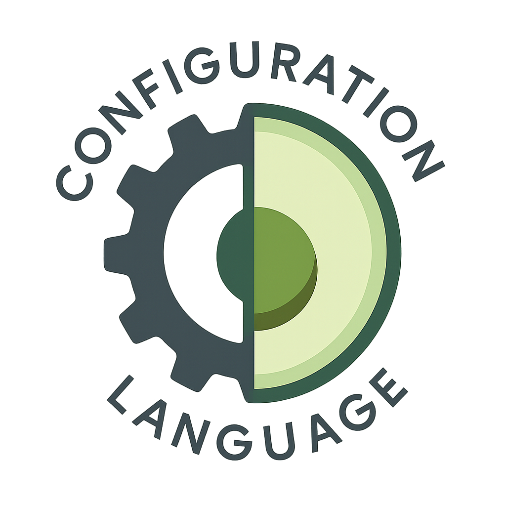

# ConfigurationScript (CFGS) – Bytecode VM Edition

CFGS has been **completely redesigned**.  
The old prototype (a direct AST interpreter) has been replaced by a **stack-based bytecode Virtual Machine** with its own compiler and runtime.  
The **syntax was refined** so the **lexer, parser, compiler, and VM** work together cleanly.  
This project also served to **deepen my compiler engineering knowledge**.

> **Note**
> - The old project is archived for historical reasons but is no longer developed.
> - CFGS is **work in progress** and may still contain bugs.

---

## Getting Started

[Here is a short Introduction](https://github.com/BlackFoX1991/ConfigurationScript-VM/blob/af7cb4bd74b0ef7b580d12349cd174a6a0f059a1/CFGS_NE/Tutorial/Introduction.md)

### Allowed at top level

* **Empty statement:** `;`
* **Variable declarations:** `var x = ...;`
* **Function declarations:** `func name(args) { ... }`
* **Class and enum declarations:** `class ... { ... }`, `enum ... { ... }`
* **Identifier-leading statements**

  * Calls: `print("hi");`
  * Assignments: `x = 1;`
  * Index / push ops that begin with an identifier
* **Block `{ ... }`** (but still treated as top level: the same restrictions apply inside unless you’re inside a function/class)

### Not allowed at top level

* **Control flow & exceptions:** `if`, `while`, `for`, `foreach`, `match`, `try/catch`, `throw`
* **Function/loop control:** `return`, `break`, `continue`
* **`delete`**
* **Non-identifier-leading expression statements**, e.g.:

  * Leading `await`: `await sleep(100);` ✗
    (Use it embedded: `var x = await foo();` or `print(await foo());`)
  * Bare literals: `"hi";`, `123;` ✗

### Rule of thumb

Top level is for **declarations** and **statements that start with an identifier**.
All control flow, exception handling, `return`/`break`/`continue`, `throw`, and `delete` are only valid **inside function or class bodies**.

---

## Table of Contents

1. [Algebraic Expressions](algebraic-expressions.md)
2. [Ternary Operator](ternary-operator.md)
3. [Null Coalescing](null-coalescing.md)
4. [Variables](variables.md)
5. [Arrays](arrays.md)
6. [Dictionaries (Objects)](dictionaries-objects.md)
7. [Slicing](slicing.md)
8. [Strings (Intrinsics)](strings-intrinsics.md)
9. [Functions](functions.md)
10. [While Loops](while-loops.md)
11. [For Loops](for-loops.md)
12. [If / Else](if-else.md)
13. [Match / Case](match-case.md)
14. [Break & Continue](break-continue.md)
15. [Try-Catch-Finally](try-catch-finally.md)
16. [Closures / Functions as Values](closures-functions-as-values.md)
17. [Classes (Instances, Statics, Inheritance)](classes-instances-statics-inheritance.md)
18. [Enums](enums.md)
19. [Built-ins (selected)](built-ins-selected.md)
20. [Examples](examples.md)

---
